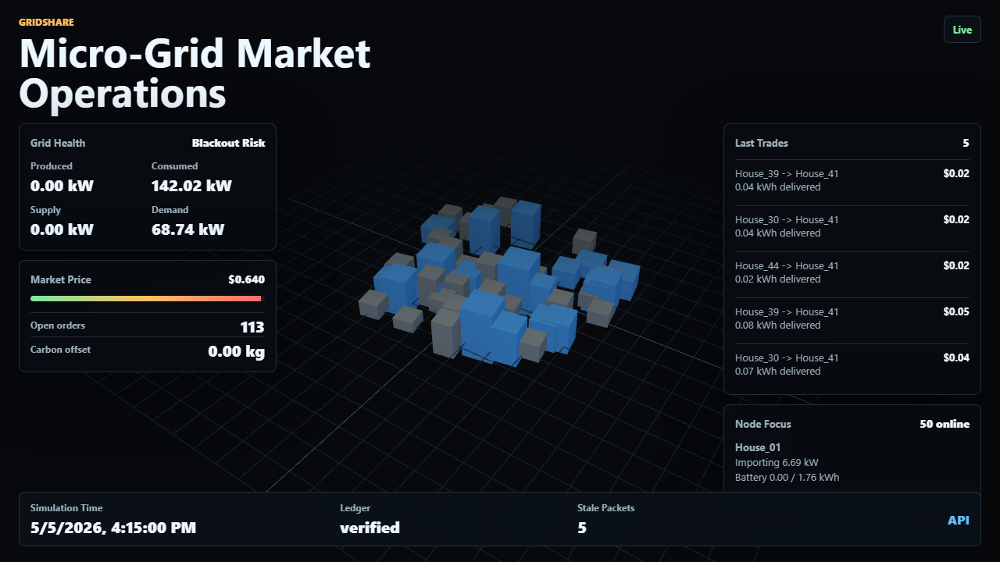

# GridShare Simulation Engine

[](https://dotnet.microsoft.com/)
[](https://learn.microsoft.com/dotnet/csharp/)
[](.github/workflows/ci.yml)
[](LICENSE)
[](ARCHITECTURE.md)
[](GridShare.Tests)
[](GridShare.Cli)
[](GridShare.Api)
[](GridShare.Api/wwwroot)
[](API.md)
[](docker-compose.yml)
[](TELEMETRY.md)
[](TELEMETRY.md)
[](release/README.md)

GridShare is a micro-grid marketplace prototype built with a hexagonal shape:

- `GridShare.Domain`: immutable records and core grid concepts.
- `GridShare.Application`: market operation, matching, pricing, ledger ports, and in-memory ledger adapter.
- `GridShare.Simulation`: replaceable simulation adapter that produces house energy snapshots.
- `GridShare.Infrastructure`: MongoDB ledger persistence, IoT JSON ingestion, telemetry export, and replay.
- `GridShare.Cli`: real-time console dashboard.
- `GridShare.Api`: ASP.NET Core API, background simulation worker, and SignalR feed for a 3D dashboard.
- `GridShare.Tests`: unit tests for market, pricing, ledger, line-loss, and diurnal behavior.

## Screenshots

[](docs/assets/dashboard.png)

Live operations dashboard, 1280x720: an isometric micro-grid map with animated node state, market price, grid health, recent trades, stale packet count, carbon offset, and ledger verification state.

Screenshot assets live in `docs/assets/`, so future API, CLI, and replay-mode captures can be added without changing the README structure.

## Run

```powershell
dotnet run --project GridShare.Cli -- --houses 50 --ticks 96 --delay-ms 250
```

Use `--live` for an endless dashboard:

```powershell
dotnet run --project GridShare.Cli -- --live
```

Display in another supported currency:

```powershell
dotnet run --project GridShare.Cli -- --currency INR
```

Export telemetry while running:

```powershell
dotnet run --project GridShare.Cli -- --ticks 96 --csv telemetry/gridshare.csv --jsonl telemetry/gridshare.jsonl
```

Replay an exported JSONL file:

```powershell
dotnet run --project GridShare.Cli -- --replay telemetry/gridshare.jsonl
```

CSV export creates a small telemetry bundle:

- `gridshare.csv`: node-level time series, one row per house per tick.
- `gridshare.market.csv`: one market aggregate row per tick.
- `gridshare.trades.csv`: one row per ledger transaction.
- `gridshare.accounts.csv`: one settlement account snapshot per node per tick.
- `gridshare.anomalies.csv`: anomaly events, only when detected.

The node CSV includes location-aware energy-market fields, local retail/export tariffs, production, consumption, battery state of charge, stale packet flags, demand pressure, delivered kWh, line loss, settlement value, carbon offset, and next-hour forecast aggregates. JSONL export uses schema version `2.0` and keeps the full market snapshot, node snapshots, open orders, accounts, anomalies, forecast, and aggregate metrics in each line.

Defaults simulate 50 houses, 15 simulated minutes per tick, and a 24-hour day in 96 ticks.

## Releases

Build local release packages:

```powershell
./release/publish-cli.ps1 -Version 0.1.1
./release/publish-api.ps1 -Version 0.1.1
```

See `release/README.md`, `release/cli.md`, and `release/api.md` for artifact details, Docker packaging, and smoke tests.

## API

```powershell
dotnet run --project GridShare.Api -- --urls http://localhost:5077
```

Open `http://localhost:5077` for the live operations dashboard. Swagger remains available at `http://localhost:5077/swagger`.

Useful endpoints:

- `GET /api/grid/state`
- `GET /api/grid/frame`
- `GET /api/currencies`
- `GET /api/energy-markets`
- `GET /api/grid/ledger`
- `GET /api/grid/accounts`
- `GET /api/grid/health`
- SignalR hub: `/hubs/grid`, event name `grid.tick`

Set `ConnectionStrings:MongoLedger` in `GridShare.Api/appsettings.json` or environment configuration to enable persistent MongoDB ledger storage. When blank, the API uses the in-memory ledger.

Run MongoDB locally:

```powershell
docker compose up -d
$env:ConnectionStrings__MongoLedger="mongodb://localhost:27017"
dotnet run --project GridShare.Api -- --urls http://localhost:5077
```

Copy `.env.example` into your deployment environment for the supported runtime knobs.

## Dashboard

The browser dashboard is served from `GridShare.Api/wwwroot` and uses:

- Three.js for the live isometric micro-grid map
- SignalR for real-time ticks
- HUD panels for grid health, price, ledger status, trades, carbon offset, stale packets, and node focus
- a currency picker for USD, EUR, GBP, AUD, INR, JPY, CNY, BRL, ZAR, MXN, AED, and KES

The data contract is the same one exposed by `/api/grid/frame`, so a future Three.js or Unity client can replace the bundled dashboard without changing the market engine.

## Simulation Model

`SmartHouse` is an actor-like simulated node with a unique ID, location, reliability behavior, and `HouseHardwareProfile`:

- panel capacity in kW
- battery storage in kWh
- base load in kW
- morning and evening consumption peaks
- stochastic consumption variance
- household archetype: standard, EV owner, work-from-home, solar-only, battery-heavy, or low-income critical load
- critical load in kW

The diurnal model uses Gaussian curves:

- solar production peaks around noon and is cut off at night
- residential load peaks around morning activity and evening activity
- weather changes solar output using cloud cover, temperature, and seasonal sunrise/sunset

Each tick produces an `EnergySnapshot`. Local batteries charge or discharge first, and only the remaining `GridExchangeKw` becomes market-visible supply or demand.

Reliability simulation can drop packets, repeat stale readings, or delay readings to exercise reconnect/reconciliation paths.

## Market Model

`MarketOperator` depends on `EnergySnapshot` inputs, not `SmartHouse`, MQTT, SignalR, or any other adapter. A future IoT adapter only needs to produce the same snapshots. `IotJsonSnapshotSource` already demonstrates that adapter boundary with broker-style JSON payloads.

Pricing is dynamic:

- high market surplus pushes price toward the floor
- high market demand pushes price toward the ceiling
- ask and bid orders are based on each node's `EnergyMarketProfile`, using location-specific residential tariffs and solar export prices
- consumers reduce flexible demand when prices cross the elasticity threshold

The ledger uses USD as the base settlement unit, while the CLI and browser can convert display values into supported world currencies. The seeded market-rate catalog is intended as a transparent reference table for simulation; production deployments should update `EnergyMarketCatalog` or replace it with a tariff/FX feed.

`MatchmakerEngine` prioritizes:

- proximity between grid nodes
- price compatibility
- community battery fallback for unmatched surplus

`OrderBook` keeps unmatched asks and bids across ticks, with time-to-live expiry. `DistanceLineLossModel` reduces delivered kWh by route distance. `SettlementService` tracks wallet balances, battery credits, node earnings, and unpaid obligations.

Every completed trade is appended as a `TradeBlock` with delivered kWh, line loss, settlement amount, carbon offset, SHA-256 hash, and previous-hash chain.

## Data Science

- `ForecastingEngine` predicts the next hour of production, consumption, and grid exchange.
- `AnomalyDetector` flags impossible readings, production spikes, and load spikes.
- `CarbonAccountingService` estimates avoided grid emissions per tick.

## Observability

The API registers OpenTelemetry metrics:

- `gridshare.trades`
- `gridshare.price_per_kwh`
- `gridshare.demand_pressure`

Metrics currently export to console and can be swapped to OTLP by changing the OpenTelemetry exporter setup.

## Tests

```powershell
dotnet test GridShare.slnx
```

## Edge Cases

Blackout scenario: if market-visible demand greatly exceeds market-visible supply, the dashboard flags `BLACKOUT RISK`. Pricing rises toward the ceiling, flexible demand is reduced by price elasticity, critical-load orders are protected during rationing, unmatched demand remains visible, and no false trade is recorded for energy that could not be delivered.

Disconnected house node: the market only records matched trades that reach the ledger append step. If a house loses connectivity before a trade is finalized, no block is appended. If it reconnects later, ledger integrity is verified by replaying every block hash and previous-hash link.
